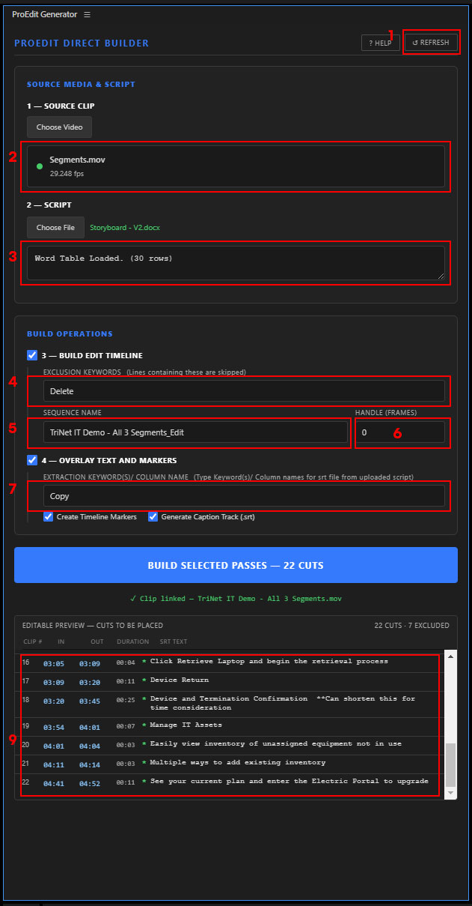
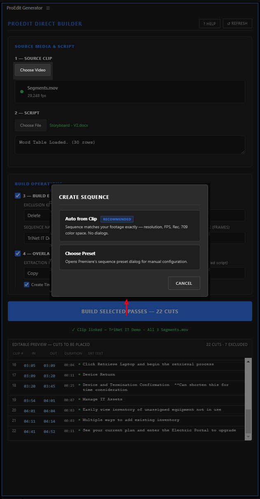
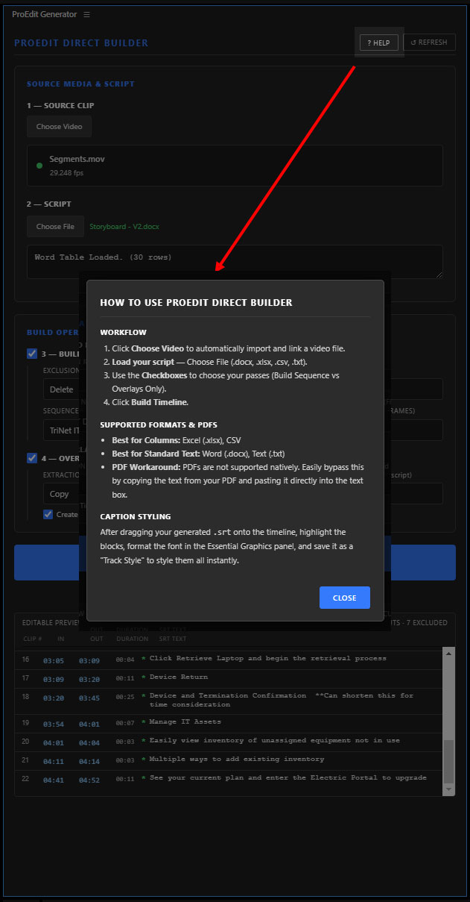
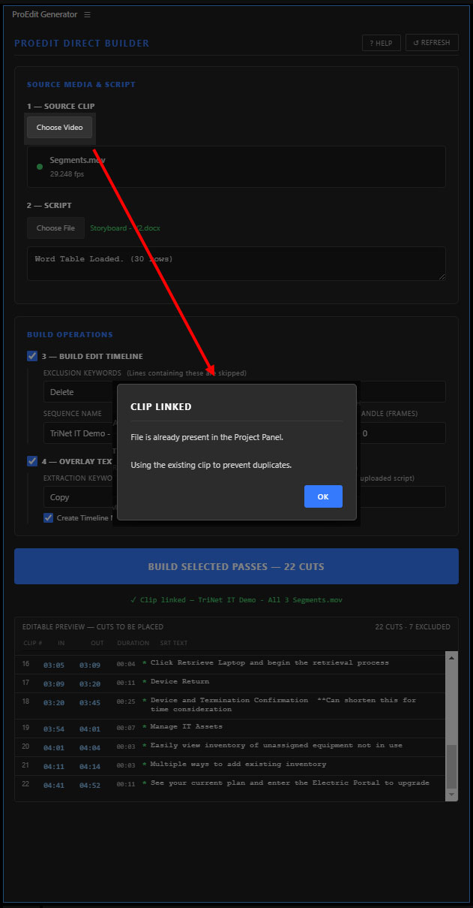
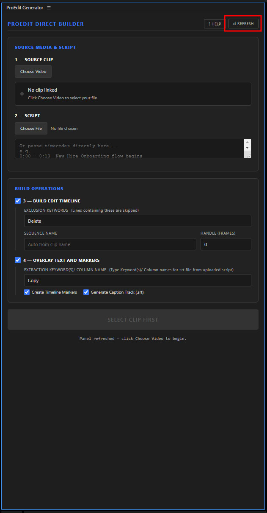

🎬 ProEdit Direct Builder

ProEdit Direct Builder is a powerful Adobe Premiere Pro extension designed to automate the most tedious parts of video editing: cutting raw footage to a script and formatting on-screen text.

Upload your client's script (Excel, CSV, Word, or plain text), select your source video, and the Builder will instantly generate a fully cut timeline, complete with timeline markers and an auto-formatted .srt caption track.

🚀 Installation Guide

Method 1: ZXP Installer (Recommended)

Download a free ZXP installer like Anastasiy's Extension Manager or ZXPInstaller.

Open the Extension Manager and drag the ProEditDirectBuilder.zxp file into the window.

Restart Premiere Pro. Go to Window > Extensions > ProEdit Direct Builder.

Method 2: Manual Installation

Copy the ProEditDirectBuilder folder to the extensions directory:

Windows: C:\Program Files (x86)\Common Files\Adobe\CEP\extensions\

Mac: /Library/Application Support/Adobe/CEP/extensions/

Enable Debug Mode: On Windows, double-click the included Enable_Debug_Mode.reg file. On Mac, run defaults write com.adobe.CSXS.11 PlayerDebugMode 1 in Terminal.

📖 How to Use

Follow the red numbered rectangles in the screenshots below to master the workflow.

1. Select Source Media & Script

Click to refresh/reload Tool (1).

Click Choose Video to link your footage. Once linked, you can verify the file metadata, frame rate, and duration in the clip badge (2).

The tool displays the row count and parsing status in the box marked (3).

2. Build Operations

Enter Exclusion Keywords (4) to skip lines like "Delete".

Set your custom Sequence Name (5) (it autofills with the same name as the uploaded clip and adds the suffix "_Edit").

Add Handle Frames (6) to add extra padding to every cut.

Enter the Extraction Keyword (7) for your captions—it will look for this keyword in the document and the "Column Header" in spreadsheet documents.

Before building, review all cuts in the Editable Preview (9) where you can verify timecodes and SRT text before they are placed.

3. Build Timeline

Click the blue Build button. Choose Auto from Clip to create a sequence that matches your footage exactly, or Choose Preset for manual control.

4. Pop-Ups and prompts to confirm actions and guide usage

The tool includes several helpful prompts to guide you, such as the help manual and clip link confirmations.

📝 Client Script Formatting Best Practices & Gotchas

Spreadsheets Are King: .xlsx files to ensure 100% data alignment.

One Row = One Cut: Ensure the Timecode and Copy live horizontally on the exact same row.

Exact Column Names: If your column is named Text Layer, ensure you type Text Layer into the Extraction Keyword box.

Built with ❤️ 
